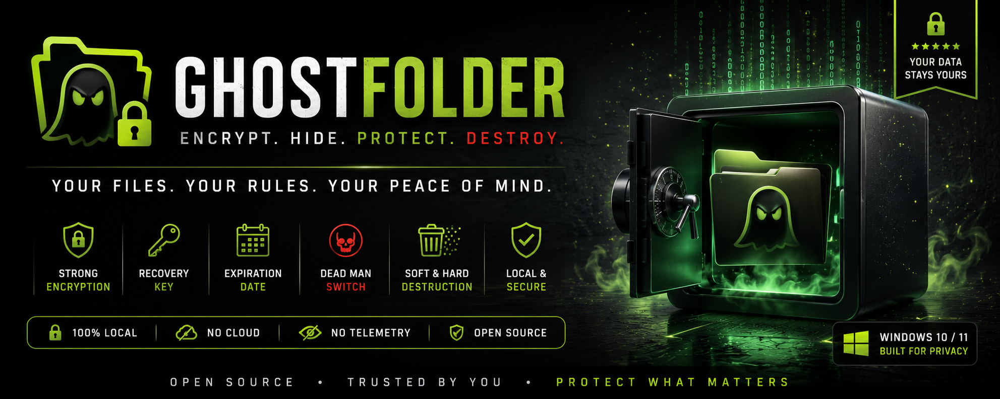
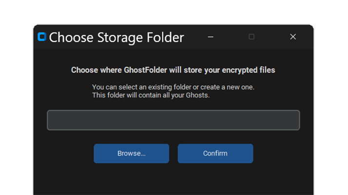
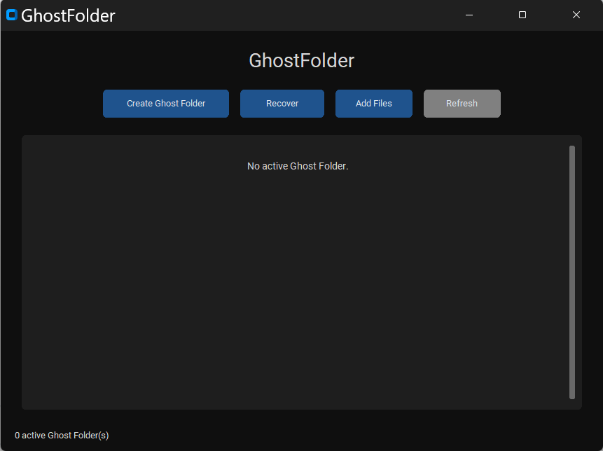
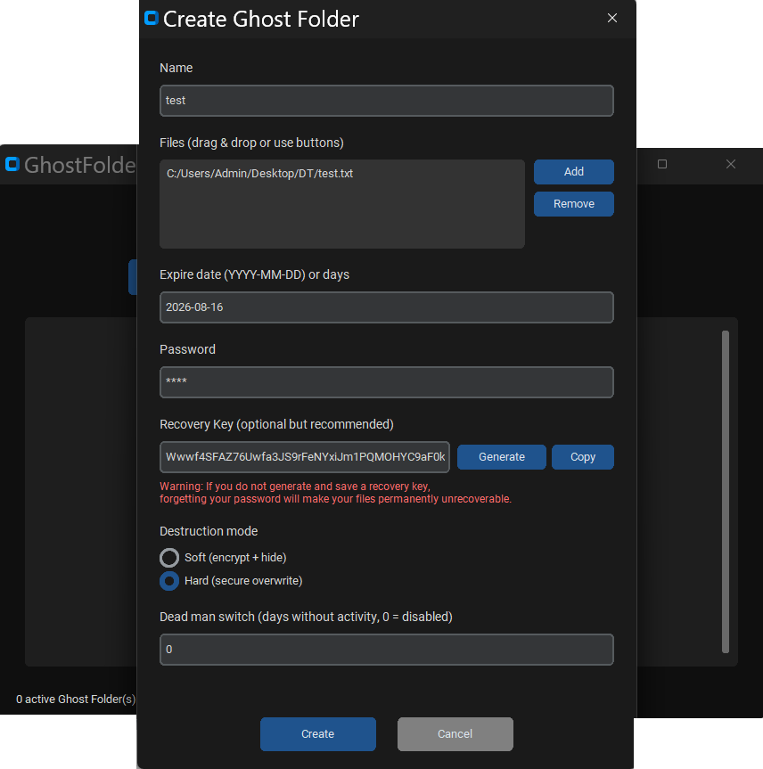
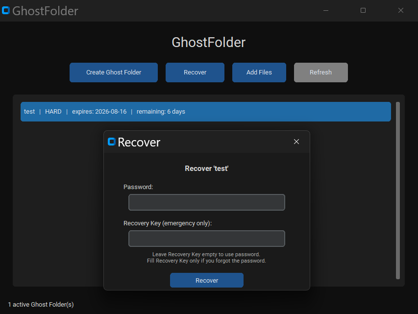
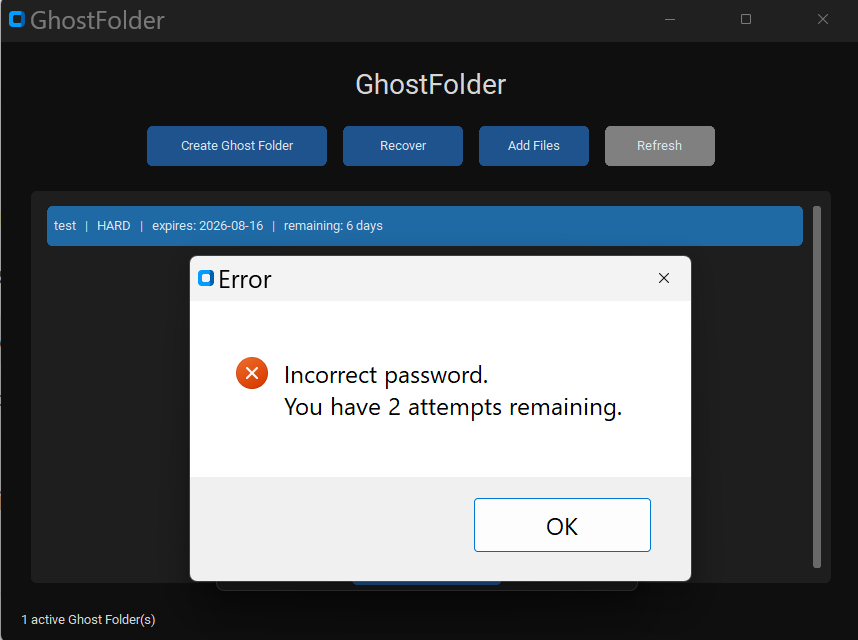
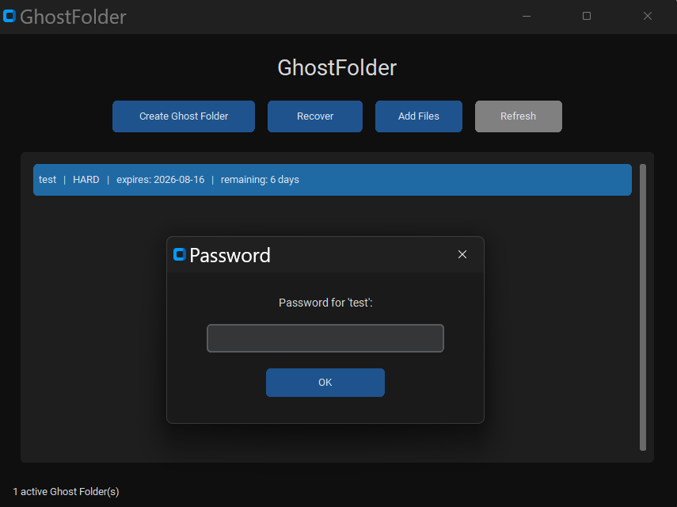
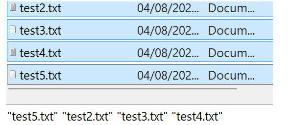
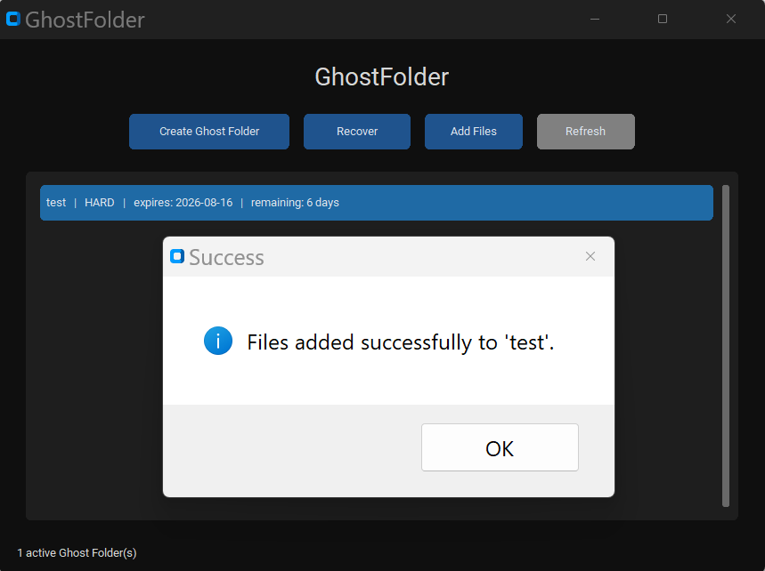
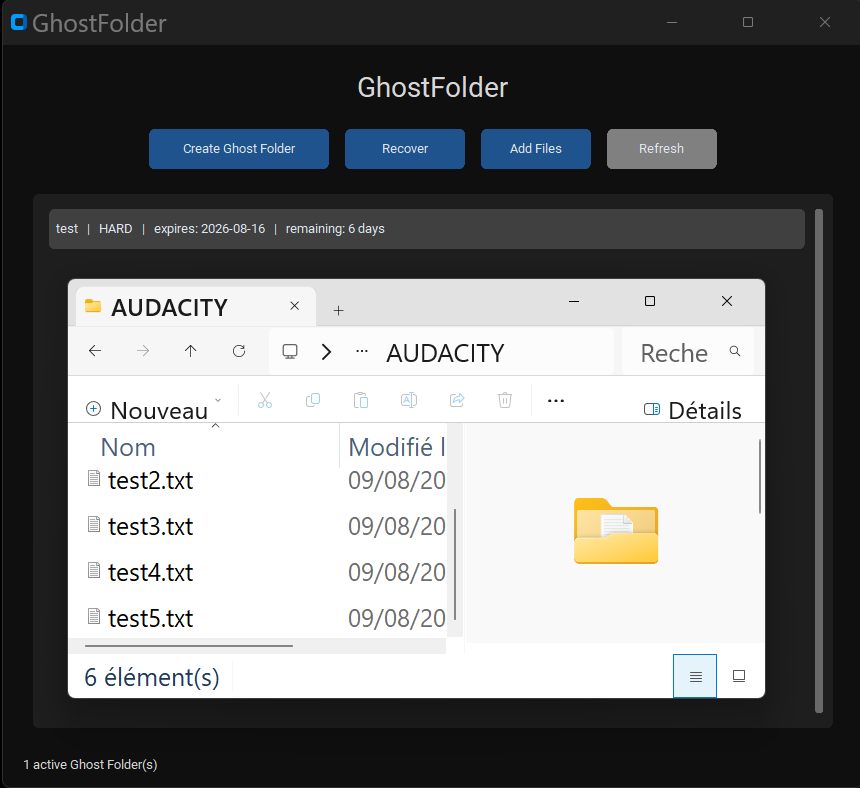

Copyright (C) 2026 ErnestoKade

<p align="center">
  
</p>

# GhostFolder

**GhostFolder** is a local, open-source tool that lets you create encrypted Ghost folders.  
Your files are encrypted, hidden, and can self-destruct under specific security conditions.

No cloud. No telemetry. No background services.

---

## Features

- Strong encryption (**Fernet + PBKDF2 with 480,000 iterations**)
- Password protection
- Recovery Key (with `.key` export and load)
- Expiration date
- Soft / Hard destruction modes
- Failed attempts protection (auto-destroy after 3 wrong passwords)
- Dead Man Switch
- Add files to existing Ghosts
- Fully local storage
- Portable (can run from a USB drive)
- Modern dark UI (CustomTkinter)
- Drag & Drop support

---

## How to use

### 1. First launch



Choose the folder where all encrypted Ghosts will be stored.  
This location can be on your computer, an external drive, or a USB device.

---

### 2. Create a Ghost



Click **Create Ghost Folder** to start creating a new encrypted Ghost.

---

### 3. Configure your Ghost



- Enter a name for the Ghost folder
- Add one or more files using **Add** or **drag & drop**
- Choose an expiration date
- Set a strong password
- Generate a **Recovery Key**
- Click **Save** to export the Recovery Key as a `.key` file
- Choose the destruction mode (**Soft** or **Hard**)
- Click **Create**

> **Important**  
> After **3 wrong password attempts**, the Ghost is automatically destroyed.  
> Only the Recovery Key can save it in that case.

---

### 4. Recover a Ghost



- Select the Ghost
- Click **Recover**
- Enter the password  
  **or**
- Click **Load .key** and select your Recovery Key file
- Choose the destination folder

Your files will be restored to the selected folder.

---

### 5. Wrong password protection



After 3 failed attempts, the Ghost is destroyed.  
In that situation, **only the Recovery Key** can recover the data.

---

### 6. Add files to an existing Ghost



- Select the Ghost
- Click **Add Files**
- Enter the password
- Choose the files to add

The new files will be encrypted and added to the existing Ghost.

---

### 7–9. Additional screens

  
  


---

## Requirements

- Windows 10 / 11
- Python 3.10 or higher (for source builds)

---

## Installation (from source)

```bash
git clone https://github.com/ErnestoKade/GhostFolder.git
cd GhostFolder
pip install -r requirements.txt
python main.py```

Or simply run the provided GhostFolder.exe.

### Security notes

If you lose both the password and the Recovery Key, the data is permanently unrecoverable.
Hard destruction mode securely overwrites data before deletion.
Everything remains on your computer.
GhostFolder never connects to the internet.
Always keep a backup of your Recovery Key (.key file).

### Disclaimer

GhostFolder is provided as is.
The author is not responsible for data loss.
Always keep a backup of your Recovery Key and important files.

### License

This project is licensed under the GNU General Public License v3.0 (GPL-3.0).


